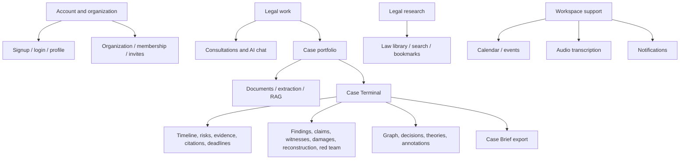

# I Love Lawyer — Feature Architecture

**Scope:** functional architecture across `ilovelawyer-app` and `ilovelawyer-api`. Paths are relative to their respective repository directories. This is a code-oriented map: route and model names are taken from the current source, and names can differ from UI copy.

## 1. Product map

## 2. Feature map

| Feature | Frontend area | API area | Core data / integrations |
| --- | --- | --- | --- |
| Authentication and account | `app/(auth)`, protected layout, `lib/auth`, `lib/store/auth.store.ts` | `routes/auth.route.ts`, `controllers/auth.controller.ts`, `services/auth.service.ts` | `User`, `Session`; JWT, password hashing, OTP/email, Google OAuth, refresh cookie |
| Tenants and organizations | `homepage/organization`, `lib/organizations`, tenant-code helpers | `routes/organization.route.ts`, organization controllers/services and organization middleware | `Tenant`, `Organization`, `OrganizationMember`, `CaseAccess`; membership and role checks |
| Consultations / AI chat | `homepage`, `lib/chat`, chat components | `routes/chat.route.ts`, chat controller/service, chat generation queue | `Consultation`, `Message` and associated message-output records; Chat Wonder, SQS, sockets |
| Case portfolio / access | `homepage/case-portfolio`, `homepage/create-case`, case query/mutation modules | `routes/case.route.ts`, case and case-access services | `Case`, `Party`, `CaseAccess`, `AuditEvent`; active organization scope |
| Documents and evidence ingestion | case workspace/document UI, `lib/cases`, upload batching, file route handler | `routes/user-document.route.ts`, `case-document.route.ts`, `files.route.ts`; extraction/chunk services | `Document`, `File`, `CaseDocumentChunk`; S3, SQS, Textract/extraction libraries, Redis, vector search |
| Case Terminal | `homepage/terminal/[caseId]`, terminal panels/components and `lib/terminal` | `routes/terminal.route.ts`, case-terminal controllers, domain services | Timeline, risk, matrix/custody/contradictions, citation checks, deadlines, findings, witnesses, damages, claims, reconstruction, red team, graph, theory, decision, annotation models |
| Case Brief exports | Terminal export UI | case-terminal export endpoints, generated-document services/routes | `CaseBriefExport`, case/document and analysis data; PDF/DOCX generation, S3/file proxy |
| Law library and research | law/library pages, `lib/law`, case citation UI | `routes/law.route.ts`, `legal.route.ts`, `legal-rag.route.ts`, legal source cache routes | `Law`, citation models, bookmarks, cached legal analysis; tenant-aware PH/UK legal providers |
| Calendar and notifications | `homepage/calendar`, notifications components and query modules | `routes/calendar.route.ts`, event and notification routes, webhook controller | `Event`, `CalendarWatchChannel`, `Notification`; Google Calendar, Socket.IO, reminder queue |
| Audio transcription | `homepage/transcription`, transcription library and mutations | `routes/transcription.route.ts`; transcription services/queues | `Transcription`, `TranscriptionChunk`; S3, AWS Transcribe, audio processing |
| User notes and preferences | profile, note UI, theme/language/display stores | user/note routes, model-settings service where applicable | `User`, `Note`, `ModelSetting`; browser storage for non-sensitive preferences |
| Admin and integrations | UI/API support surfaces | `routes/admin.route.ts`, jurisdiction/integration routes, model settings | admin role, `JurisdictionModule`, `IntegrationConnector`, `ModelSetting`, law corpus |

## 3. Authentication, onboarding, and organization membership

### Account lifecycle

The auth screens cover signup, email verification, login, Google login, password reset, and login-link consumption. `AuthSvc` hashes password credentials, creates and verifies users, creates a per-device `Session` row, and issues an access token plus a rotating refresh token. The API writes the refresh token to an httpOnly cookie; the frontend holds the access token in memory. On application mount, the frontend attempts a silent refresh before allowing protected pages to render.

The account model supports direct tenant assignment for solo users and membership through an organization. Tenant is derived from the request host/origin for signup and organization creation. The tenant code selects jurisdiction-specific legal behavior. Email verification is enforced for password login; Google identity is considered verified by the provider.

### Organization boundary

The user selects an active organization in the frontend. `apiFetch` adds its id as `X-Organization-Id`. API resource routes resolve membership fresh from the database and attach role and tenant code to the request. Organization routes use their `:id` path parameter for membership checks. This design allows organization switching/removal to take effect without minting a new token.

Organization roles gate administration of membership/settings. Case access has a separate case-level permission model, so organization membership does not necessarily imply edit rights to every case. Case attachment across organizations passes through explicit membership and case-access checks.

## 4. Consultation and AI chat

### User-visible behavior

Users create consultations, send messages, revisit persisted conversation history, and may associate a consultation with a case or attach documents. Message-associated features include generated response content and structured supporting outputs such as timeline, mind map, related cases, reasoning, decision records, research steps, and generated documents.

### Architecture and flow

`chat` frontend query/mutation code calls the organization-scoped chat API. The backend validates consultation access, persists user input and generation state, then schedules the chat-generation queue. The worker assembles conversation history and any eligible case/document context, calls Chat Wonder, persists the assistant response and structured outputs, and emits progress through the API/socket pathways. Case-linked outputs may schedule separate case-graph promotion work.

Documents used for RAG are selected by case or consultation scope. The API can return whole-case text when it is below the configured inline threshold and otherwise relies on ranked chunks and scoped callbacks. Chunk retrieval is exposed to Chat Wonder through API-key-protected routes, with an additional recent-turn allowlist for document ids. BM25 reranking is used for chunk ordering; embedding-based ranking selects relevant chunks upstream where configured.

### Important boundaries

- The API owns canonical message persistence; Chat Wonder performs model reasoning/generation.
- A model-generated citation or evidence reference is not automatically authoritative. The data model includes grounding checks and decision-record verification structures.
- Case-linked consultation access is still governed by case/organization authorization; possession of a consultation id is not intended as sufficient authorization.
- Conversation cancellation and queue retries must preserve message/job status consistency.

## 5. Case portfolio, evidence, and document intelligence

### Case lifecycle

The portfolio supports listing and filtering cases, case creation, updates, archive/unarchive, bulk operations, parties, and case attachment. Cases carry tenant/jurisdiction context and are protected by organization membership plus case-level access policy. Case routes centralize organization resolution; services are responsible for checking access on the requested case itself.

### Document upload and extraction

The main case-document workflow separates control-plane metadata from file transfer:

1. Client requests presigned upload authorization for an accessible case/consultation.
2. API creates/validates the storage key and returns short-lived PUT URL(s).
3. Browser transfers bytes to S3 using the signed URL.
4. Client registers the file/document with the API and associates it with case or consultation scope.
5. Extraction queue reads the stored object, extracts text and metadata, persists document text/chunks/status, and schedules follow-up citation/case-processing work.
6. UI observes status by API/socket and offers preview, archive, restore, delete, and exhibit controls.

`Document` is the case/consultation evidence record; `File` describes stored bytes. `CaseDocumentChunk` holds chunk text and retrieval metadata. The API has extraction support for PDFs and office formats, and audio/transcription paths. S3 object deletion is not identical to deleting a document row: orphan detection marks files for deletion and a queue/service handles delayed account-deletion cleanup.

### Retrieval and evidence governance

The retrieval architecture uses document status, case/consultation scope, embeddings, BM25, and cached chunk results. Archived documents are excluded from selection and callback retrieval. The callback API exposes only documents recently shared with Chat Wonder for a turn. Case exports distinguish explicitly marked exhibits from all uploaded documents.

## 6. Case Terminal feature architecture

The Terminal is a case-level workspace assembled from snapshot/query endpoints and domain-specific mutations. It exposes legal analysis while keeping user edits separate from generated analysis where the model requires provenance.

| Terminal capability | Domain records / service role |
| --- | --- |
| Case snapshot and refresh | Aggregated case state; refresh service regenerates or rechecks derived analysis and records audit reasons |
| Timeline | `CaseTimelineEvent`; extraction/promotion from chat and documents, with manual updates |
| Risks | `CaseRisk`; tracked severity/status and user edits |
| Evidence matrix | `EvidenceMatrixItem`, `EvidenceCustodyEvent`, `EvidenceContradiction`; evidence quality, custody and contradiction scan |
| Citations | `CitationCheck`, `CitationEdge`, law lookup and citation validity/proposition checks |
| Procedure and deadlines | `ProceduralDeadline`, confirmations, `ProcedureItem`; jurisdiction-specific deadline engine and user confirmation |
| Findings, witnesses, damages, claims | `CaseFinding`, `Witness`, `DamageClaim`, `CaseClaim`; case investigation and merits records |
| Reconstruction | `CaseReconstruction`; narrative plus verified source-referenced scenes; table-read audio and storyboard UI |
| Red team | `RedTeamAssessment`; structured adversarial review of the case position |
| Case graph | `CaseGraphNode`, `CaseGraphEdge`, `CaseEdge`; linked evidence, people, propositions and events |
| Decisions | `MessageDecisionRecord` is promoted into durable `DecisionRecord`; dispute/reactivate status and annotations preserve disagreement history |
| Case theories | `CaseTheory` and child claims/assumptions/questions; user-authored alternatives coexist, AI can propose and compare but should not silently merge them |
| Annotations | `Annotation`; comments/disputes attached to supported case element types |
| Export | `CaseBriefExport`; creates downloadable PDF/DOCX snapshots and history |

The frontend is organized under `homepage/terminal/[caseId]` with panels and shared components. Mutations are grouped in `lib/terminal/mutations.ts`. Backend behavior is split between terminal controllers and case-specific services. Use the service/model corresponding to each panel for changes; avoid implementing domain logic in the React panel or controller.

## 7. Legal research and authority library

The library presents browsable legal materials, document records, and law detail pages. Research pathways include case-law/statute search, citations, legal RAG, source analysis, bookmarks, and links back into case work. Core persisted entities include `Law`, `CitationEdge`, `LawBrowsePage`, `Bookmark`, and `LegalSourceAnalysisCache`.

Tenant-specific provider registries choose PH or UK legal knowledge/search integrations. Prompt, deadline, and law-source behavior is registered by tenant rather than scattered as host checks through UI components. UK-specific integrations include the UK Legal MCP endpoint and National Archives/legislation canonical URLs; PH integrations use juris.ph endpoints. External legal providers and their availability are runtime dependencies, so results should preserve source URLs and relevant provenance.

## 8. Case Brief and generated documents

Case Terminal export endpoints create a case brief in PDF or DOCX form from case facts and selected structured work product, track export history, and return a file link. Generated document registration is a server-to-server API-key-protected route used by Chat Wonder. The browser-facing file route streams signed content through the app origin, keeping direct S3 signatures out of the UI. Output should be treated as a dated snapshot; edits to the underlying case do not retroactively change a previously generated artifact.

## 9. Calendar, notifications, and collaboration

Calendar watch registration requires an authenticated user and a Google access token, either stored from OAuth or provided to the registration request. Google calls the public webhook endpoint, which resolves a channel id, refreshes credentials, fetches calendar events, and syncs them into the owner's organization. A reminder queue supports event notifications. Notifications are queryable via REST and pushed via Socket.IO; the frontend mounts one notification socket bridge at the app-provider layer.

Consultation participant/invite models support conversation sharing. Organization membership invites are separate from consultation invites. Case collaboration additionally uses case access grants and audit records. These are distinct authorization systems and should not be conflated.

## 10. Transcription and audio features

Transcription screens provide audio upload, job start/polling, chunk handling, editing, and library views. Data is stored in `Transcription` and `TranscriptionChunk`; the service/queue layer coordinates S3 and AWS Transcribe. Audio overview uses a generation queue, Polly synthesis, and ffmpeg to concatenate short clips. Case reconstruction table reads reuse multi-voice synthesis and audio assembly. Long-running generation status is surfaced to the frontend through polling and realtime events where available.

## 11. Account administration and provider configuration

Admin routes require a valid session and a current `ADMIN` role read from the database. Admin capabilities include user review/state actions and law search/browsing. Jurisdiction modules and integration connectors have authenticated configuration routes. Model settings use an API key protected server-to-server route. These areas are operational controls: expose them only through the intended trusted admin/provider paths and retain auditability for state changes.

## 12. Frontend shared architecture

- **Route groups:** `(auth)` handles account access; `(protected)` applies the client auth gate; `homepage` contains application features; `/files/[token]` handles protected file streaming.
- **API layer:** `lib/fetch.ts` adds auth/org headers, handles refresh and retries once after a 401, and handles empty 204 responses. API version paths are centralized in `lib/api-version.ts`.
- **Server data:** feature-specific query/mutation modules use TanStack Query with shared cache defaults. Query keys are centralized where practical.
- **Client state:** Zustand stores session identity/token and small UI state. Access tokens are memory-only; language and display preferences use browser storage.
- **Presentation:** shared UI components live in `packages/ui`; app components compose feature views and use `react-i18next` locale JSON resources.
- **Realtime:** socket hooks are kept in feature libraries and mounted at shared providers for app-wide notification updates.

## 13. Cross-feature invariants

1. Resolve an authenticated user before resolving organization membership; never accept a client-supplied organization id as proof of membership.
2. Check case/document access in the service handling the resource id, even when an organization was resolved at the route.
3. Keep tenant/jurisdiction choice explicit in legal provider, prompt, and deadline selection.
4. Preserve the difference between raw uploaded documents, explicitly marked exhibits, and verified reconstruction source references.
5. Persist user-facing generation status and canonical output; queues and provider callbacks are delivery mechanisms, not the source of truth.
6. Treat AI citations, claims, and evidence links as generated data subject to provenance/verification rules.
7. Invalidate Redis/query caches when source documents or derived case state changes.
8. Keep file authorization separate from storage URLs: use short-lived signed upload/read capabilities and avoid exposing credentials.
9. Keep consultation invites, organization membership, and case-level access as separate scopes with explicit transitions.

## 14. Open architecture questions for product/engineering

- Which Terminal panels are read-only derivations versus independently authored records, and what is the source-of-truth precedence when both exist?
- What is the authoritative list of legal-provider coverage and jurisdiction-specific limitations shown to users?
- Which generation paths guarantee idempotency across SQS redelivery, API fallback, and worker restart?
- What is the lifecycle/retention policy for case files, generated exports, temporary upload keys, and account-deletion artifacts?
- Which records are visible to all organization members versus users granted case-level access, especially for consultation-linked documents?
- Which Socket.IO events are durable notifications versus transient progress signals?
- What deployment process runs Prisma migrations and separates HTTP capacity from memory/CPU-heavy jobs?
