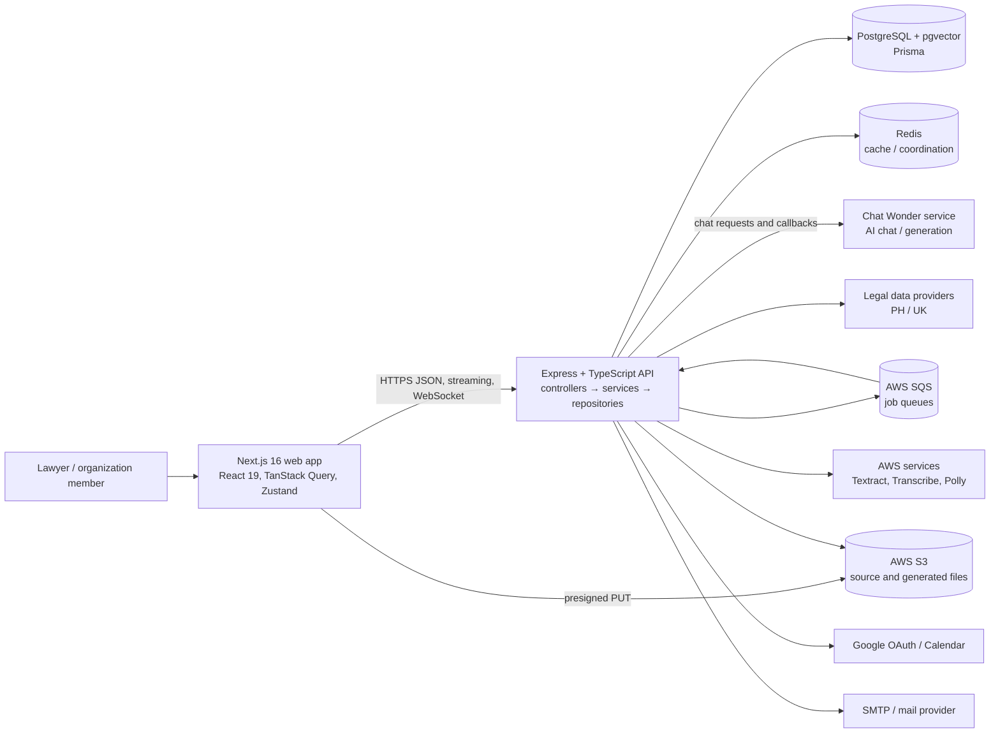

# I Love Lawyer — System Architecture

**Scope:** the `ilovelawyer-app` web client and `ilovelawyer-api` backend in the adjacent workspace directories. This document describes the architecture visible in the source tree. Hosted infrastructure details that are not represented in the repository are called out as unknowns.

## 1. System at a glance

I Love Lawyer is a multi-tenant legal-work platform. A browser-based Next.js application serves lawyers. It calls an Express API for authentication, organization-scoped case work, legal research, consultations, and document workflows. PostgreSQL with pgvector is the durable application store; Redis provides caching and shared transient state; S3 stores uploaded and generated files; SQS carries background work. The API also integrates with external AI, legal-data, identity, email, calendar, and speech services.



The API is the authority for identity, tenant and organization membership, case/document access, and durable domain records. The web app owns presentation state and client-side navigation. Chat Wonder is an external AI service; it is not the durable source of truth for application conversations or legal work product.

## 2. Deployable units and code boundaries

### Web application (`ilovelawyer-app`)

- A pnpm workspace containing the Next.js app in `apps/web`, a shared UI package, and shared ESLint/TypeScript configuration packages.
- App Router route groups separate `(auth)` screens from `(protected)` application pages. The protected layout restores authentication client-side before showing protected content.
- `lib/fetch.ts` centralizes API calls, bearer-token attachment, the active `X-Organization-Id`, refresh-on-401 behavior, and the selective same-origin proxy path for cookie-related auth calls.
- TanStack Query manages server data and mutations. Zustand stores short-lived browser state such as the access token, active organization, language, and selected UI state.
- `next.config.ts` rewrites the auth paths to the API. Other API requests go directly to the configured API origin because the app needs streamed chat responses to flush incrementally.
- `/files/[token]` is a Next route handler for browser-friendly file streaming. The browser receives a same-origin application path; the API validates its signed token and provides a short-lived S3 read URL behind that handler.

### Backend (`ilovelawyer-api`)

- A standalone Express + TypeScript service. `src/app.ts` configures CORS, JSON parsing, cookies, Helmet, rate limiting, Swagger, API routers, and the final error handler. `src/server.ts` starts the HTTP server and queue consumers.
- Route files define URL/middleware composition. Controllers validate request input and shape responses. Services contain business rules and orchestration. Repositories isolate Prisma access. Joi schemas validate request payloads.
- `src/lib` holds shared Prisma, Redis, SQS, and Socket.IO clients. `src/legal` contains tenant-aware provider registries and prompts.
- Queue classes are consumers/producers in the API process. They currently run alongside HTTP handling; the Dockerfile builds one API image rather than defining a separate worker image in this repository.

## 3. Request and trust boundaries

### Browser to API

Most calls send `Authorization: Bearer <access token>` and credentials. Protected resource routes commonly require `X-Organization-Id`; `resolveOrganization` verifies that the authenticated user belongs to that organization and attaches its role and tenant code to the request. Organization URL routes resolve membership from the organization id in the path. Active organization selection is deliberately not embedded in the JWT.

Auth endpoints which set or consume the refresh-token cookie are routed through the Next app's same-origin rewrite. The refresh token is httpOnly and scoped to `/api/auth`; the access token stays in the frontend Zustand store in memory. A non-secret `hasSession` cookie is a client hint only.

The API mounts its router at both `/api` and `/api/v1`. The frontend helper applies the versioned path to API calls. CORS uses the configured `CLIENT_URL` allowlist and enables credentials. The API also exposes Socket.IO for live updates.

### API to Chat Wonder

The API sends chat and generation work to the configured Chat Wonder service. Chat Wonder calls back to protected API routes for case-document chunks and generated-document registration using `x-api-key`. The document-chunk routes add a recent-turn scope check; a shared API key alone does not grant access to arbitrary case documents.

### Browser to object storage

For case-document workflows, the API issues short-lived presigned S3 upload URLs and the browser uploads file bytes directly to S3. The browser then asks the API to create/link a document record. Reads normally use signed application proxy tokens, with the API minting a short-lived S3 GET URL only when the Next route handler needs it. General `/api/files/upload` is a separate API-buffered upload path.

### External providers

The API integrates with AWS S3, SQS, Textract, Transcribe, and Polly; Google OAuth and Calendar; SMTP; OpenAI; Chat Wonder; and PH/UK legal-data sources. Provider selection and prompt/deadline behavior are tenant-aware in the legal registries. Secrets and provider endpoints arrive through environment variables. The checked-in source does not identify production account topology, network policy, secret manager, backup plan, or monitoring platform.

## 4. Data architecture

Prisma schema in `ilovelawyer-api/prisma/schema.prisma` is the central domain map. PostgreSQL is configured with pgvector for embedding-backed document retrieval. Major record families are:

| Domain | Representative records | Purpose |
| --- | --- | --- |
| Identity and access | `User`, `Session`, `Tenant`, `Organization`, `OrganizationMember`, `CaseAccess`, `AuditEvent` | Accounts, rotating refresh sessions, PH/UK region boundary, org roles, case-level access and audit history |
| Consultations | `Consultation`, `Message`, `MessageGroup`, `ConsultationParticipant`, `ConsultationInvite` | User/AI conversations, messages, participation and sharing |
| Case and evidence | `Case`, `Party`, `Document`, `File`, `CaseDocumentChunk` | Case records, parties, uploaded documents, object references, extracted text/chunks and retrieval metadata |
| AI enrichments | `MessageTimeline`, `MessageMindMap`, `MessageRelatedCases`, `MessageReasoning`, `MessageDecisionRecord`, `MessageGeneratedDocument`, `MessageResearchSteps`, `AnswerGroundingCheck` | Structured outputs attached to a chat turn and evidence/answer checks |
| Case terminal | `CaseTimelineEvent`, `CaseRisk`, `EvidenceMatrixItem`, `EvidenceCustodyEvent`, `EvidenceContradiction`, `CitationCheck`, `ProceduralDeadline`, `ProcedureItem`, `CaseFinding`, `Witness`, `DamageClaim`, `CaseClaim`, `CaseReconstruction`, `RedTeamAssessment` | Case analysis, procedural tracking, evidence and legal strategy work product |
| Case knowledge graph | `CaseGraphNode`, `CaseGraphEdge`, `CaseEdge`, `CaseEdgeArchive`, `DecisionRecord`, `CaseTheory`, theory child records, `TheoryDiff`, `Annotation` | Relationships, AI decision provenance, independently authored theories and comments/disputes |
| Legal research/library | `Law`, `CitationEdge`, `LawBrowsePage`, `Bookmark`, `LegalSourceAnalysisCache`, `JurisdictionModule`, `ModelSetting` | Legal authorities, citation relations, saved references, cached analysis and feature/provider settings |
| Other workspace features | `Event`, `CalendarWatchChannel`, `Note`, `Notification`, `Transcription`, `TranscriptionChunk`, `TerminalWorkspace`, `IntegrationConnector`, `CaseBriefExport` | Calendar, notes, notifications, audio transcription, workspace presets, integrations and export history |
| Background work | `AiGenerationJob` | Durable status/coordination for queued AI generation |

The dominant isolation chain is **user → organization membership → organization tenant → case/document access**. Some consultation/document flows also use ownership or participant relationships. A full schema-level constraint and access audit was not performed for this document; route-specific service checks remain the enforcement point to inspect when changing data access.

Redis is used for cached document chunks and other shared state. Document chunk cache keys include document or case/consultation scope. Cache invalidation is therefore important whenever document text, status, or links change. S3 keys and database `File` records represent stored bytes; deleting a database reference and deleting the S3 object are separate lifecycle steps in the source design.

## 5. Synchronous and asynchronous workflows

### API request lifecycle

1. Express applies cross-origin, body, cookie, security-header, and production rate-limit middleware.
2. Route middleware authenticates a bearer token or server-to-server API key. Resource routes resolve organization membership where required.
3. Joi validation runs at the controller/service boundary.
4. A service applies domain access rules and coordinates repositories and providers.
5. Prisma persists state; Redis/S3/provider calls are used as needed.
6. The controller returns JSON, a stream, or an appropriate HTTP status. The terminal error handler maps validation/domain errors and hides unexpected internal errors.

### Chat turn

```mermaid
sequenceDiagram
  participant B as Browser
  participant A as API
  participant DB as PostgreSQL
  participant Q as SQS
  participant W as Chat Wonder
  B->>A: Send message (bearer + active org)
  A->>DB: Validate consultation/case scope; persist turn/job state
  A->>Q: Enqueue chat generation
  A-->>B: Accepted/status response and/or streamed updates
  Q->>A: Chat generation worker receives job
  A->>DB: Load scoped conversation and evidence context
  A->>W: Generate answer with ranked/full-text evidence context
  W-->>A: Streamed answer, structured outputs, document callbacks
  A->>DB: Persist canonical assistant message and structured outputs
  A->>Q: Enqueue case-graph promotion when applicable
  A-->>B: Stream/socket updates and persisted conversation result
```

The backend uses separate queues for chat generation and case-graph promotion. Chat service comments identify the queue worker as the owner of the full generation lifecycle, rather than the initiating request. In-process fallback/retry paths exist for some enqueue or worker failures; they improve continuity but mean a queue outage can move load back onto the API process.

### Document ingestion

1. A user requests an upload URL for a case/consultation document.
2. The API validates access and issues a short-lived presigned PUT URL.
3. The browser uploads to S3, then registers the file/document metadata with the API.
4. The document-extraction queue performs extraction and indexing; extraction uses file bytes from S3 and supported text/PDF/office/audio processing libraries and AWS services.
5. Extracted text and chunks are stored in PostgreSQL. Citation extraction and case post-extraction jobs can be scheduled as follow-up work.
6. The API reports document status to the frontend, with sockets used for live extraction updates. Chat retrieval uses embeddings/ranking and scoped chunk callbacks.

### Other queue families

The API starts consumers for document extraction, citation extraction, chat generation, AI generation, case graph promotion, audio overview audio, case reconstruction audio, event reminders, and account deletion. Queue URLs are independently configured. Local development supplies LocalStack SQS and an init container to create queues. The queue client includes long polling and visibility-heartbeat support for jobs exceeding the standard SQS visibility timeout.

## 6. Background job and realtime model

- **SQS** is the durable delivery mechanism for long-running and deferred jobs. The source includes separate queue URL configuration per job family and warns that independently polled queue consumers must not share a physical queue unless message routing is coordinated.
- **`AiGenerationJob`** provides persisted status for user-visible AI generation actions. The API routes these through a common generation queue.
- **Socket.IO** is initialized on the API HTTP server and supports user-facing realtime events such as notifications and job/document progress. REST remains the durable query/mutation interface.
- **Redis** is used as a shared cache/coordination layer. The exact production Redis topology, eviction policy, persistence mode, and high availability are deployment concerns not specified in this workspace.
- Workers currently start from `src/server.ts` in the same deployable process as the API. Scaling HTTP and CPU/memory-heavy workers independently would require a worker entrypoint/deployment split or equivalent process-role configuration.

## 7. Security model reflected in code

- Access tokens are JWTs; refresh tokens are rotated and persisted in `Session` rows for revocation. Refresh token cookies are httpOnly, secure outside development, and same-site lax.
- Active organizations are resolved against current membership on each resource request. Role middleware checks organization roles; admin middleware reads the role from the database rather than trusting a token claim.
- Server-to-server routes use the Chat Wonder API key. Case-document callbacks also check recent-turn document scope.
- File reads use expiring signed proxy tokens; S3 GET signatures are short-lived and minted server-side.
- Express uses Helmet and disables `x-powered-by`; JSON request bodies have a 1 MB cap; the API file upload route has a 25 MB cap.
- Configuration contains a `scoped-auth` shortcut in the general session middleware. It bypasses JWT verification and does not populate `req.user`; treat this as a sensitive legacy/internal boundary and verify its intended callers before expanding use.
- Production rate limiting is broad and IP-based. Auth-specific limits and upload quotas are not evident in the route setup reviewed.

## 8. Runtime and local development

- API image: multi-stage Node Alpine build, Prisma generation, TypeScript compilation, and ffmpeg in the production image for audio concatenation.
- Local infrastructure compose file: PostgreSQL/pgvector, Redis, Redis Commander, LocalStack SQS, and one-shot queue creation. AWS object storage and external providers still require appropriate local configuration or substitutes.
- Web app runs on port 3002; API defaults to port 3001. API configuration is environment-driven; the frontend uses `NEXT_PUBLIC_API_URL` for API calls and can load `.env.staging` explicitly at build time.
- The API README is a stale starter-template description and does not reflect the Prisma/tenant architecture. Use source configuration and schema as the operational reference until setup documentation is refreshed.

## 9. Architectural strengths and constraints

**Strengths:** clear route/controller/service/repository layering; active organization membership checks; explicit PH/UK provider registries; separation of long-running jobs into named queues; durable job and AI enrichment records; object-storage uploads that avoid routing large case files through the API; legal answer grounding and provenance structures.

**Constraints to keep in mind:** many product features live in a single large API service and share runtime resources; background consumers are coupled to API startup; multiple source-of-truth boundaries exist across PostgreSQL, Redis, S3, and Chat Wonder; document and generated-file cleanup must coordinate database references with object storage; the frontend keeps access tokens in browser memory and depends on refresh-cookie routing; provider configuration is broad and environment-sensitive.

## 10. Unknowns to resolve from deployment/operations

This workspace does not establish the production hosting topology, number of API/worker replicas, SQS retry/DLQ configuration, database migration release process, production backup/restore objectives, Redis availability/eviction policy, S3 lifecycle and encryption settings, observability/alert ownership, secret rotation, or incident response procedures. These should be documented from the live deployment rather than inferred from application code.
